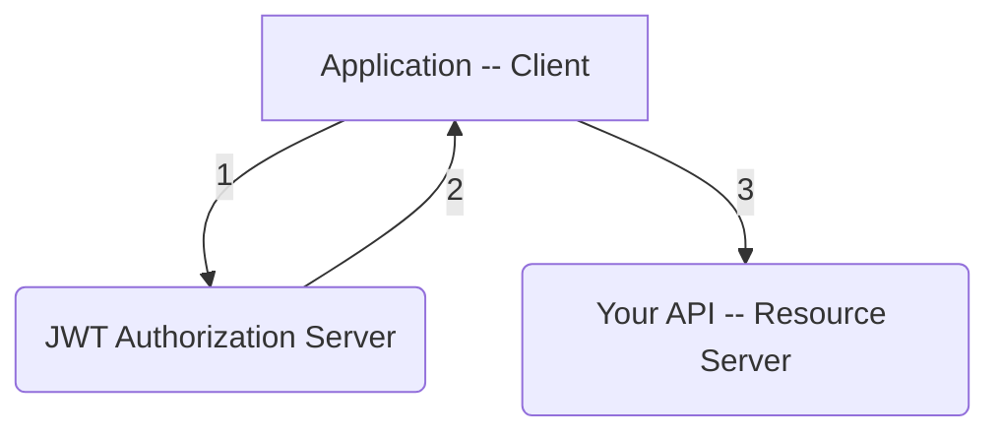
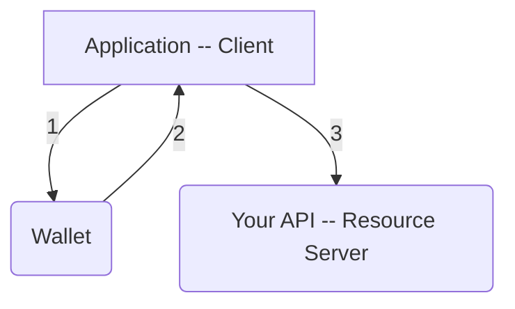

# web3-api-auth-token (WAAT)

- [web3-api-auth-token (WAAT)](#web3-api-auth-token-waat)
- [WAAT?](#waat)
  - [Why should I use WAAT?](#why-should-i-use-waat)
  - [What is the Web3 API Auth Token structure?](#what-is-the-web3-api-auth-token-structure)
    - [Strategy](#strategy)
    - [Payload](#payload)
    - [Signature](#signature)
    - [Putting all together](#putting-all-together)
  - [How does WAAT work?](#how-does-waat-work)
    - [Token Validity](#token-validity)
  - [Why we should use WAAT?](#why-we-should-use-waat)
  - [This sounds like JWT, is it?](#this-sounds-like-jwt-is-it)
- [How to create a new Strategy?](#how-to-create-a-new-strategy)
- [Roadmap](#roadmap)
  - [Strategies](#strategies)
  - [Middleware](#middleware)

# WAAT?

Web3 API Auth Token (**WAAT**) defines a compact and self-contained way for securely transmitting information between the parties as a base64Url encoded JSON object. the information can be verified and trusted because it is digitally signed and the signature provided as a part of the token. WAAT is completely agnostic about the way the Strategies validate the payload. Because of this design approach, the WAAT is also agnostic about the RAW type of the signature and encourages the best practices for each Strategy.

Most of the users will use WAAT in an unencrypted way, meaning, the payload is just encoded and available to everyone who knows how to decode it. For now, we will focus on _signed_ tokens. Signed tokens are very useful because the receiving party can verify the integrity of the token payload which contains the public address that was used to create the signature.

The signature is created using the Private key which is available in respective DApps, extensions or wallets. Then the signature is verified on the receiving side by using the provided Public key ( address ) to check the integrity of the signature.

## Why should I use WAAT?

Here are some scenarios where WAATs are useful:

- **Authorization**: this is the most common scenario for using the WAAT. DApps can load the users' account from the wallet browser extension, use the keys to create the signature and then make the request to the API allowing users to access resources, services and routes that are permitted with that token.
- **Information Exchange**: Web3 API Auth Tokens are an excellent way to transmit information where the integrity needs to be checked and validated. Because WAATs can be signed, any party receiving them can verify the integrity and authenticity.

## What is the Web3 API Auth Token structure?

In its compact form, the one that is sent in the Authorization header, WAAT consists of 3 parts separated by a dot `.`:

- encoded strategy (`xxxxxx`)
- encoded payload (`yyyyyyy`)
- encoded signature (`zzzzzz`)

When combined the WAAT looks like this.

`xxxxxx.yyyyyyy.zzzzzz`

### Strategy

This is the first part. Consider this as a routing rule that will know how to call a specific Strategy. A list of potential values is part of the `IAuthStrategy enum` located [here](./src/strategies/strategies.ts). The value is encoded using the [base64Url](./src/utils/base64url.ts). Check the implementation [here](./src/strategies/BaseStrategy.ts).

### Payload

This is the second part. This is Strategy specific. Every implemented strategy has complete control what is the structure and what are the required and optional keys. Some strategies can decide to have the payload as an array some can have it structured like [SubstrateStrategy](./src/strategies/substrate/index.ts). To produce the correct value the native object is serialized using the `JSON.stringify` it's encoded using the [base64Url](./src/utils/base64url.ts). Check the implementation [here](./src/strategies/BaseStrategy.ts).

### Signature

This is the third and the last part. This is Strategy specific. Every implemented strategy has complete control over how to generate the signature and what is the decoded representation. For example, the SubstrateStrategy will require that the decoded signature is a hex string starting with `0x`. Each Strategy must implement the [`encodeSignature`](./src/strategies/BaseStrategy.ts) method which will be called before serialization that is done using `JSON.stringify` and then as usual encode it using [base64Url](./src/utils/base64url.ts). Check the implementation [here](./src/strategies/BaseStrategy.ts).

### Putting all together

The output is the base64Url encoded strings separated by a dot that can be safely passed over the network, and since the encoding is URL-safe, the WAAT can be sent via the links, GET API calls, or as a part of the callback request ( authorization server ).

Here is what the final WAAT looks like:

```
c3Vi.eyJhZ2UiOjQzLCJuYW1lIjoid29zcyJ9.InNpZyI=
```

## How does WAAT work?

The closest comparison to WAAT is JWT. A user obtains JWT via the authentication scheme, usually having entered username and password. If the server that issued the JWT goes down, applications cannot be used and existing not-expired JWTs cannot be re-issued which generally leads to big problems and an app's downtime. With Web3 API Auth Token, there is no central server that is issuing the token. The WAAT is generated when needed and signed using the wallet. This way the private information is never accessed and as long as the wallet is accessible the WAAT will be produced.

Whenever the user wants to access WAAT protected API route or a resource, the user agent needs to send the WAAT, typically in the [`Authorization`](https://developer.mozilla.org/en-US/docs/Web/HTTP/Headers/Authorization) header using the [`Bearer`](https://datatracker.ietf.org/doc/html/rfc6750) schema.

The content of the header should look like this:

```
Authorization: Bearer <WAAT>
```

The servers need to implement the middleware to check and validate this header. For example, this package includes the middleware for express located [here](./src/middleware/expressV4AuthMiddleware.ts). The middleware is not long or complex. Its purpose is to `route` the request to a specific strategy based on the [first part](#strategy) and wait until two scenarios are fulfilled.

1. Token is valid
2. No error is thrown

If errors are thrown, developers can catch them and send the correct response to the end user. The provided Express middleware will throw the `StrategyValidationError` which contains the correct HTTP header for each error, making it very easy to work with and helping developers to focus on building their app and not thinking about potential HTTP codes.

### Token Validity

Each strategy determines what is considered to be a valid token. For example, the SubstrateStrategy considers a valid token to pass two checks in this order:

1. `exp` value is in the future
2. `sig` value is valid

## Why we should use WAAT?

It's compact, self-issued, self-contained, tamper-proof, a web-native structure that contains the signature for integrity checks which are based on PKI, especially the Strategy implementation PKI.

## This sounds like JWT, is it?

No, it's similar. JWT and WAAT share these similarities:

- token consists of three parts
- parts are base64Url encoded
- URL-safe
- parts are combined with the dot `.` character
- stateless
- as compact as possible
- signed
- encrypted

Beyond these similarities, the approach is completely different. Read [this](#what-is-the-web3-api-auth-token-structure) to learn more.

JWT generally requires an issuer that parties trust. This is standard JWT flow:



And this is how WAAT works:



You might say that the change is small, by only watching the diagram, then yes, but architecturally it is a big deal. Replacing a centralized server with a decentralized and self-governed component that is always Strategy specific, is the base for truly decentralized tokens.

# How to create a new Strategy?

To create a new auth strategy you need to follow a few steps:

1. make a PR
2. create a folder in [`./src/strategies`](./src/strategies) and name it. If the name is more than one word use snake-case
3. two files `index.ts` and `index.test.ts`
4. implement the new strategy by extending the `BaseStrategy` class and implement abstract methods
5. write tests for the new code. this will usually be writing a test for `validate` and `encodeSignature` methods
6. add the strategy to all middleware
7. ask for review

Do not forget to document the new interfaces and implemented methods. We are using [api-extractor](https://api-extractor.com/pages/overview/intro/) to create documentation json and md files. This also means you need to document it using the [TSDoc](https://tsdoc.org/) syntax.

**Undocumented and untested code will not be accepted!!**

The complete tutorial is in progress, in the meantime check how SubstrateStrategy is [implemented](./src/strategies/substrate/index.ts) and most importantly how it is used [in tests](./src/strategies/substrate/index.test.ts).

---

# Roadmap

If you wish to propose the strategy join, please join our [discord](https://discordapp.com/invite/fanBk5deyq) and write in the `#general` channel. For now, it is like this because we want to minimize the sources to maintain. 🙌

Icon legend:

- ✅ - this is done, has tests, reviewed and published
- 📃 - this is planned, no work is started
- ⌛ - in progress. There is an MR/PR for this
- ⏳ - done but not reviewed
- no icon - it is not planned for the near future. waiting for community requests

## Strategies

| Status | Name                              | Code                                        |
| ------ | --------------------------------- | ------------------------------------------- |
| ✅     | [substrate](https://substrate.io) | [code is here](./src/strategies/substrate/) |
| 📃     | ethereum                          | -                                           |
| -      | near                              | -                                           |
| -      | solana                            | -                                           |
| -      | avalanche                         | -                                           |
| -      | elrond                            | -                                           |
| -      | aptos                             | -                                           |

## Middleware

| Status | Name                                 | Code                                                      |
| ------ | ------------------------------------ | --------------------------------------------------------- |
| ✅     | [express v4](https://expressjs.com/) | [middleware](./src/middleware/expressV4AuthMiddleware.ts) |
